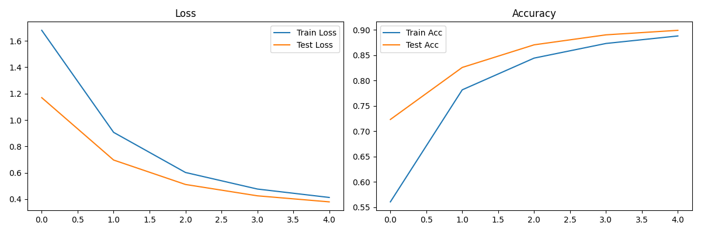
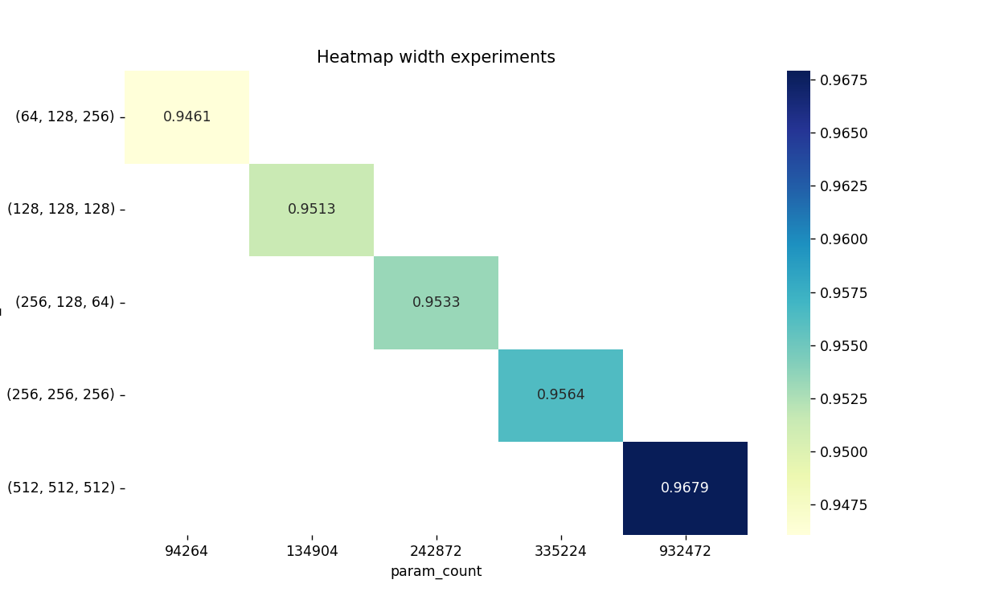
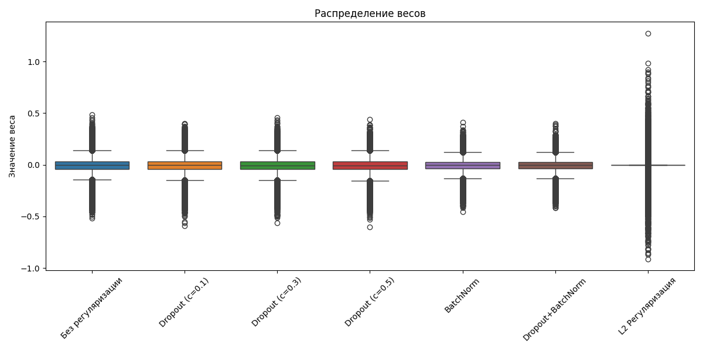

Студент: Есипов Илья Юрьевич

```(Ps: это дз было даже попроще, чем прошлое. Потратил всего лишь 5 часов, а не 8 =). Но считалось у меня на CPU нереально долго, ниже будет видно)```


# Домашнее задание к уроку 3: Полносвязные сети

## Цель задания
Изучить влияние архитектуры полносвязных сетей на качество классификации, провести эксперименты с различными конфигурациями моделей.

## Задание 1: Эксперименты с глубиной сети (30 баллов)

Создайте файл `homework_depth_experiments.py`:

## 1.1 Сравнение моделей разной глубины (15 баллов)
### Создайте и обучите модели с различным количеством слоев:
 - 1 слой (линейный классификатор)    
 - 2 слоя (1 скрытый)  
 - 3 слоя (2 скрытых)
 - 5 слоев (4 скрытых)
 - 7 слоев (6 скрытых)
 
Для каждого варианта:
 - Сравните точность на train и test
 - Визуализируйте кривые обучения
 - Проанализируйте время обучения

Для обучения я использовал датасеты с пары: MNIST и CIFAR    
Графики для обоих датасетов можно найти в папке `plots`. Сюда добавлю только один (MNIST_1_layer.png):



Время обучения существенно возрастает при увеличении слоёв, но у меня оно ещё снизилось на 5 слоях.
```commandline
Training on MNIST dataset

Training model with config: 1 layer
Number of parameters: 7960
Epoch 1/5: Train loss: 1.6619, Train acc: 0.5916, Test loss: 1.1061, Test acc: 0.7660,
Epoch 2/5: Train loss: 0.8578, Train acc: 0.8018, Test loss: 0.6638, Test acc: 0.8408,
Epoch 3/5: Train loss: 0.5880, Train acc: 0.8523, Test loss: 0.5046, Test acc: 0.8746,
Epoch 4/5: Train loss: 0.4744, Train acc: 0.8760, Test loss: 0.4264, Test acc: 0.8899,
Epoch 5/5: Train loss: 0.4140, Train acc: 0.8889, Test loss: 0.3826, Test acc: 0.9002,
Time taken to train: 96.42 seconds
Training model with config: 2 layers
Number of parameters: 407160
Epoch 1/5: Train loss: 0.9023, Train acc: 0.7453, Test loss: 0.3655, Test acc: 0.8953,
Epoch 2/5: Train loss: 0.3187, Train acc: 0.9103, Test loss: 0.2567, Test acc: 0.9295,
Epoch 3/5: Train loss: 0.2371, Train acc: 0.9337, Test loss: 0.2076, Test acc: 0.9401,
Epoch 4/5: Train loss: 0.1924, Train acc: 0.9458, Test loss: 0.1811, Test acc: 0.9480,
Epoch 5/5: Train loss: 0.1614, Train acc: 0.9538, Test loss: 0.1532, Test acc: 0.9560,
Time taken to train: 135.68 seconds
Training model with config: 3 layers
Number of parameters: 535928
Epoch 1/5: Train loss: 0.8989, Train acc: 0.7436, Test loss: 0.3433, Test acc: 0.9097,
Epoch 2/5: Train loss: 0.2729, Train acc: 0.9232, Test loss: 0.2117, Test acc: 0.9399,
Epoch 3/5: Train loss: 0.1887, Train acc: 0.9453, Test loss: 0.1675, Test acc: 0.9508,
Epoch 4/5: Train loss: 0.1466, Train acc: 0.9573, Test loss: 0.1452, Test acc: 0.9568,
Epoch 5/5: Train loss: 0.1185, Train acc: 0.9651, Test loss: 0.1208, Test acc: 0.9620,
Time taken to train: 148.29 seconds
......
```

## 1.2 Анализ переобучения (15 баллов)
Исследуйте влияние глубины на переобучение:
 - Постройте графики train/test accuracy по эпохам
 - Определите оптимальную глубину для каждого датасета
 - Добавьте Dropout и BatchNorm, сравните результаты
 - Проанализируйте, когда начинается переобучение


Сначала идёт существенное увеличение времени обучения, но с 5 layers заметно существенное падение (где-то на 15-20% быстрее).   
Причинами переобучения могут быть отсутствие регуляризации, неверная настройка гиперпараметров.
У меня вроде бы переобучение не наблюдается.


## Задание 2: Эксперименты с шириной сети (25 баллов)

Создайте файл `homework_width_experiments.py`:

### 2.1 Сравнение моделей разной ширины (15 баллов)
 Создайте модели с различной шириной слоев:
 - Узкие слои: [64, 32, 16]
 - Средние слои: [256, 128, 64]
 - Широкие слои: [1024, 512, 256]
 - Очень широкие слои: [2048, 1024, 512]
 
 Для каждого варианта:
 - Поддерживайте одинаковую глубину (3 слоя)
 - Сравните точность и время обучения
 - Проанализируйте количество параметров

Точность была высокая у всех моделей, но ширина повлияла на время обучение. На моём слабом ноутбуке оно выросло очень существенно.   
```
Модель: Узкие слои
Параметры: 53128
Time taken to train: 105.27 seconds

...

Модель: Очень широкие слои
Параметры: 4235896
Time taken to train: 277.51 seconds
```


### 2.2 Оптимизация архитектуры (10 баллов)
 Найдите оптимальную архитектуру:
 - Используйте grid search для поиска лучшей комбинации
 - Попробуйте различные схемы изменения ширины (расширение, сужение, постоянная)
 - Визуализируйте результаты в виде heatmap



Самая лучшая комбинация из проверенных мной (512, 512, 512).


## Задание 3: Эксперименты с регуляризацией (25 баллов)

Создайте файл `homework_regularization_experiments.py`:

### 3.1 Сравнение техник регуляризации (15 баллов)
 Исследуйте различные техники регуляризации:
 - Без регуляризации
 - Только Dropout (разные коэффициенты: 0.1, 0.3, 0.5)
 - Только BatchNorm
 - Dropout + BatchNorm
 - L2 регуляризация (weight decay)
 
 Для каждого варианта:
 - Используйте одинаковую архитектуру
 - Сравните финальную точность
 - Проанализируйте стабильность обучения
 - Визуализируйте распределение весов

```
+-------------------+------------+
| Метод             |   Точность |
+===================+============+
| Без регуляризации |     0.9797 |
+-------------------+------------+
| Dropout (с=0.1)   |     0.9773 |
+-------------------+------------+
| Dropout (с=0.3)   |     0.979  |
+-------------------+------------+
| Dropout (с=0.5)   |     0.9789 |
+-------------------+------------+
| BatchNorm         |     0.9808 |
+-------------------+------------+
| Dropout+BatchNorm |     0.9794 |
+-------------------+------------+
| L2 Регуляризация  |     0.9464 |
+-------------------+------------+
```

Результат у всех методов очень высокий, но выделяется L2 регулизация. Она показала результаты чуть хуже, но всё равно высокие.   
Ниже находиться визуализация распределения весов:

