Студент: Есипов Илья Юрьевич

# Домашнее задание к уроку 5: Аугментации и работа с изображениями


## Задание 1: Стандартные аугментации torchvision (15 баллов)

1. Создайте пайплайн стандартных аугментаций torchvision (например, RandomHorizontalFlip, RandomCrop, ColorJitter, RandomRotation, RandomGrayscale).
2. Примените аугментации к 5 изображениям из разных классов (папка train).
3. Визуализируйте:
   - Оригинал
   - Результат применения каждой аугментации отдельно
   - Результат применения всех аугментаций вместе

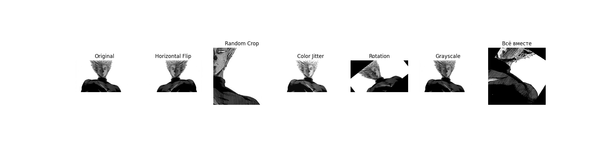
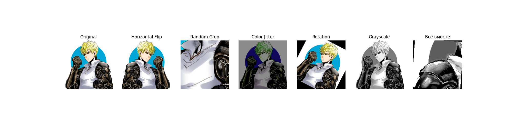
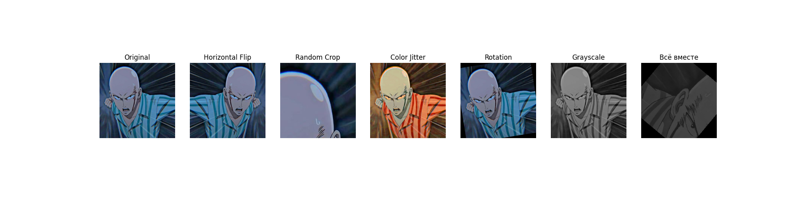
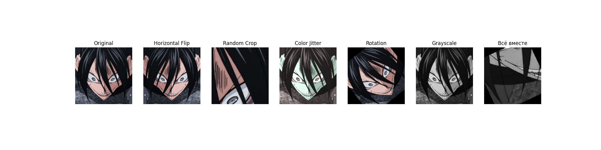
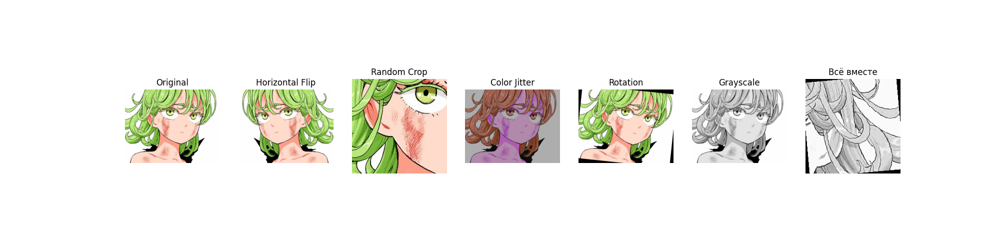

## Задание 2: Кастомные аугментации (20 баллов)

1. Реализуйте минимум 3 кастомные аугментации (например, случайное размытие, случайная перспектива, случайная яркость/контрастность).
2. Примените их к изображениям из train.
3. Сравните визуально с готовыми аугментациями из extra_augs.py.

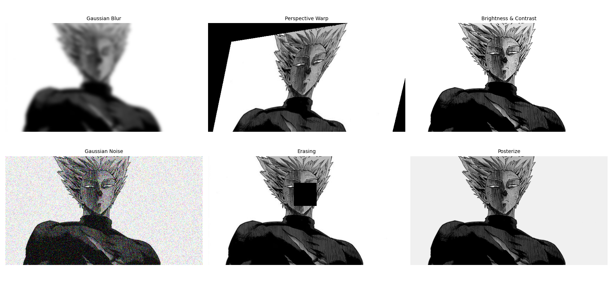
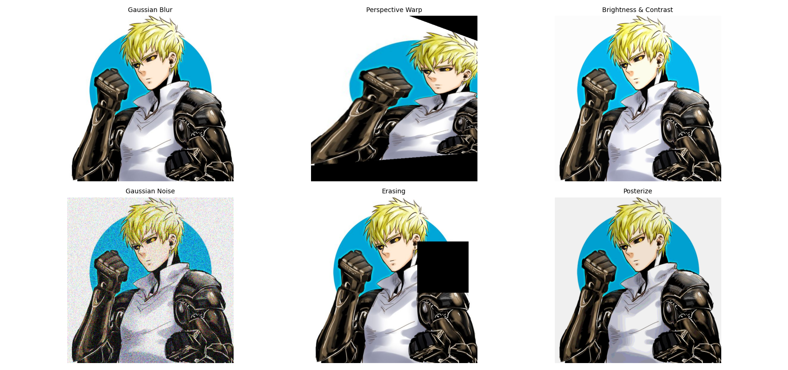
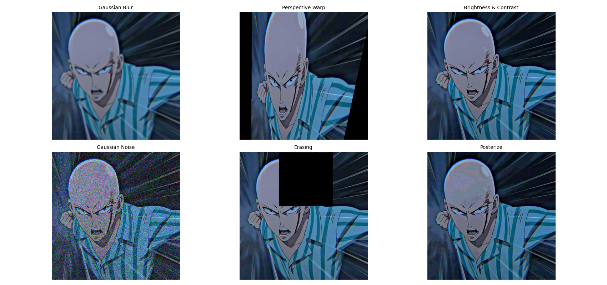
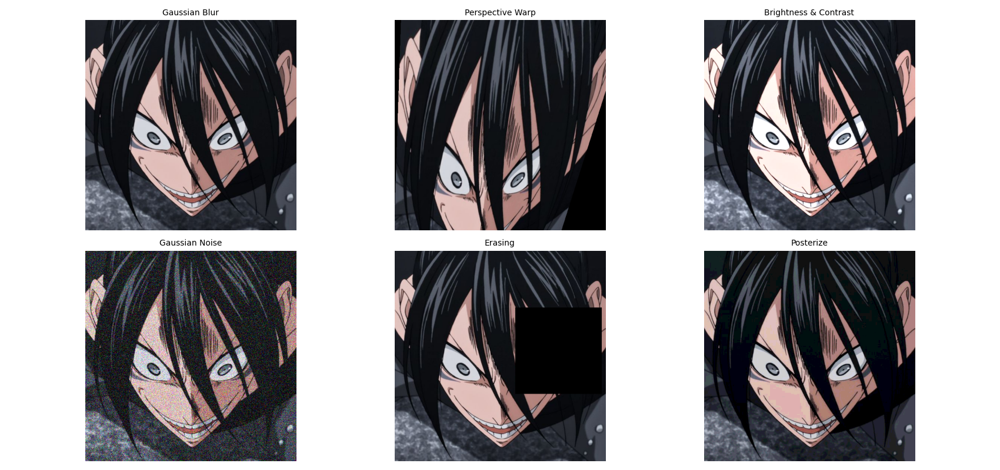
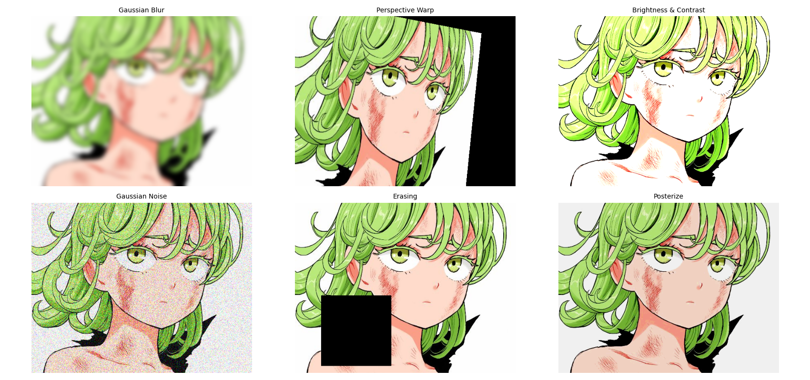

Как видно по изображениям и надписям, я реализовал случайные размытие, перспективу и яркость/контраст.

## Задание 3: Анализ датасета (10 баллов)

1. Подсчитайте количество изображений в каждом классе.
2. Найдите минимальный, максимальный и средний размеры изображений.
3. Визуализируйте распределение размеров и гистограмму по классам.
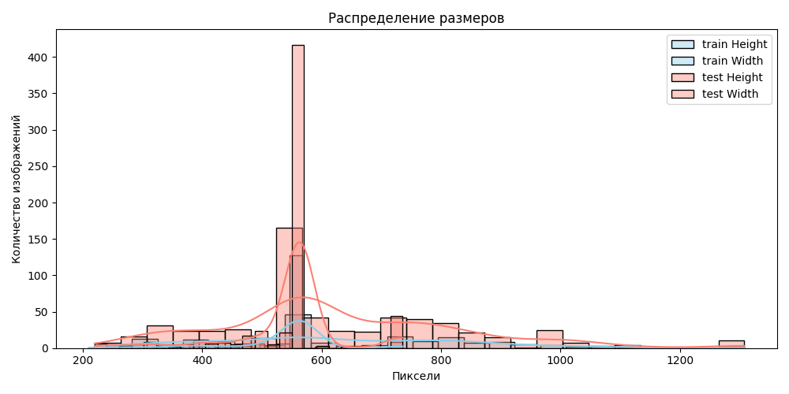
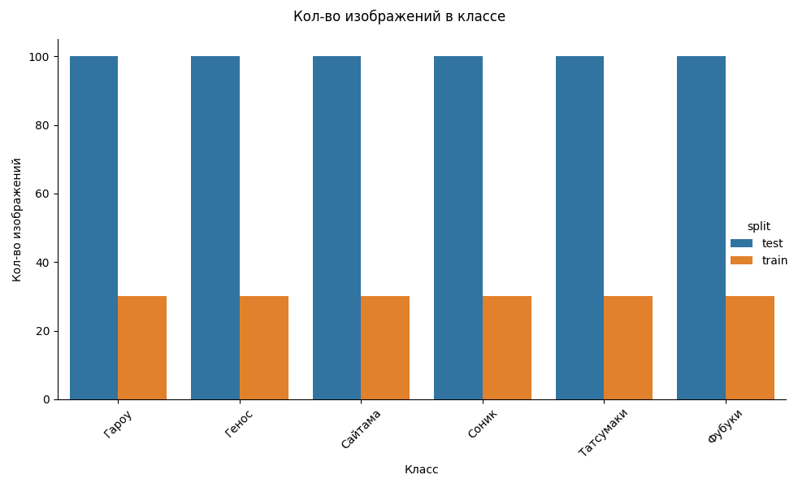

```
Средний размер: height=629.3, width=545.6
Минимальный размер: {'height': 220, 'width': 210}
максимальный размер: {'height': 1308, 'width': 736}
```
Получилось, что в test у каждого героя по 100 изображений, а в train по 30.

## Задание 4: Pipeline аугментаций (20 баллов)

1. Реализуйте класс AugmentationPipeline с методами:
   - add_augmentation(name, aug)
   - remove_augmentation(name)
   - apply(image)
   - get_augmentations()
2. Создайте несколько конфигураций (light, medium, heavy).
3. Примените каждую конфигурацию к train и сохраните результаты.


Аугментированные изображения лежат в папке results и в подпапках light, medium и heavy. Я сохранил только по 5 штук, потому что не хотел забивать гитхаб.

## Задание 5: Эксперимент с размерами (10 баллов)

1. Проведите эксперимент с разными размерами изображений (например, 64x64, 128x128, 224x224, 512x512).
2. Для каждого размера измерьте время загрузки и применения аугментаций к 100 изображениям, а также потребление памяти.
3. Постройте графики зависимости времени и памяти от размера.

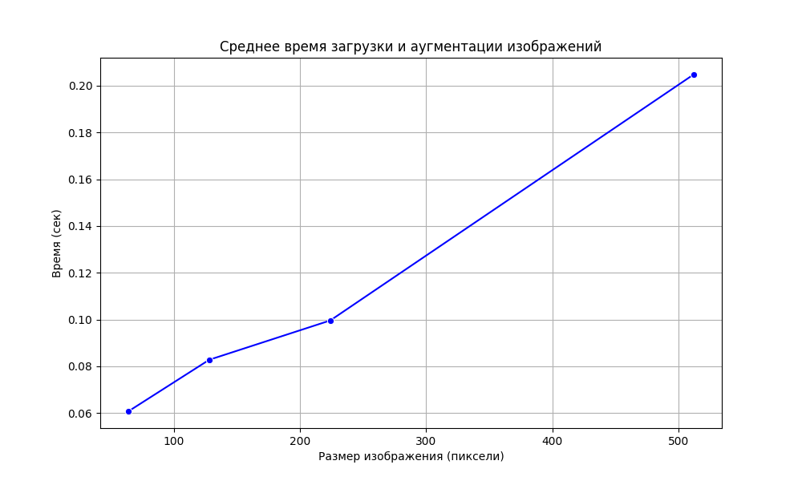
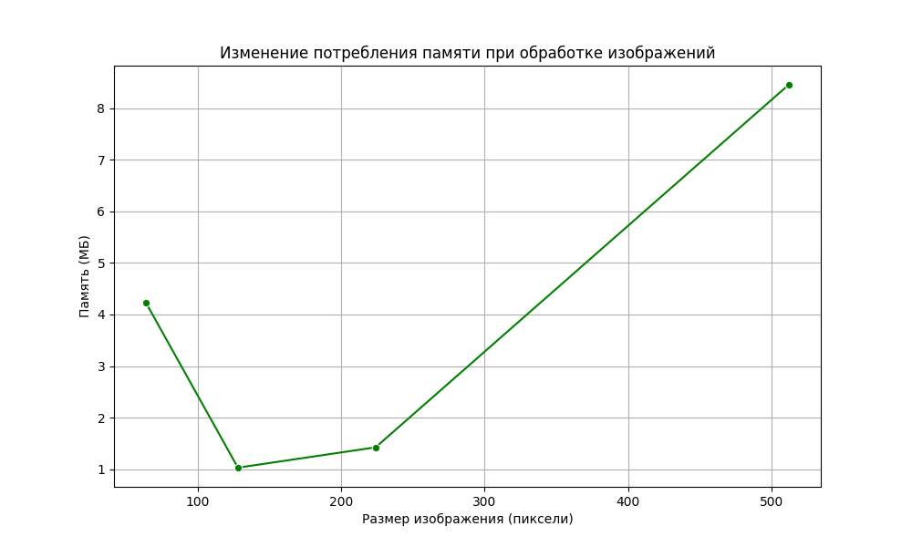

По графикам мы видим самую обычную зависимость: чем больше размер, тем больше памяти и времени тратится на загрузку и обработку.   
Но также на втором графике нельзя не заметить, что для изображения 64х64 потребовалось больше памяти, чем для 128х128 и 224х224. На самом деле я не уверен, почему так. Скорее всего это из-за того, что картинка маленькая и для её обработки требуется больше памяти. Но всегда возможно, что я ошибся где-то в подсчётах.

## Задание 6: Дообучение предобученных моделей (25 баллов)

1. Возьмите одну из предобученных моделей torchvision (например, resnet18, efficientnet_b0, mobilenet_v3_small).
2. Замените последний слой на количество классов вашего датасета.
3. Дообучите модель на train, проверьте качество на val.
4. Визуализируйте процесс обучения (loss/accuracy).
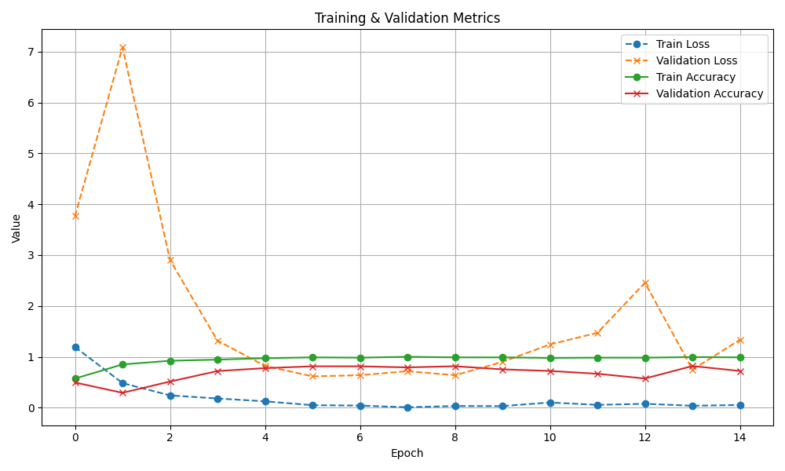

Train Loss: стабильно снижается, всё хорошо.   
Validation Loss: очень не стабилен, бывают резкие скачки. Не уверен в причине, но могу предположить, что проблема в маленьком по размеру датасете.    
Train Accuracy: стабильное высокое значение.   
Validation Accuracy: слегка не стабилен, видны колебания. Является признаком переобучения, что ещё раз указывает на проблему с маленьким датасетом.   

